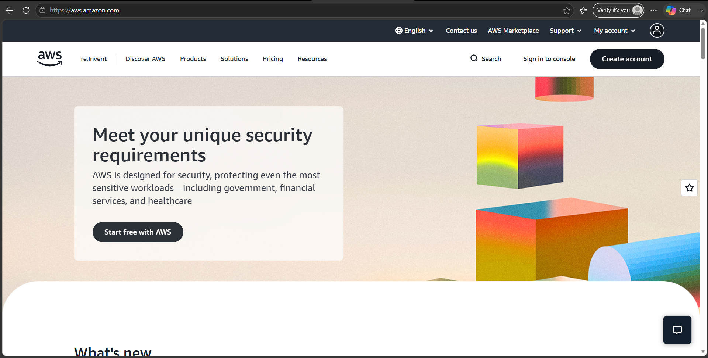

# AWS Research

## Brief Overview

Amazon Web Services (AWS) is a cloud computing platform provided by Amazon. AWS offers a wide range of cloud services for computing, storage, databases, networking, security, analytics, artificial intelligence, and application development. AWS provides services that organizations can use to build, deploy, and scale applications and IT infrastructure without needing to maintain physical servers. :contentReference[oaicite:0]{index=0}

## Global Infrastructure

AWS operates a global cloud infrastructure consisting of **Geographic Regions, Availability Zones, and Edge Locations**. AWS Regions are geographic areas where AWS data centers are located, while Availability Zones are separate locations within a Region that help improve application availability and reliability.

AWS's global infrastructure allows organizations to deploy applications closer to their customers, reduce network latency, and improve reliability. :contentReference[oaicite:1]{index=1}

## Cloud Management Console

The **AWS Management Console** is a web-based interface used to access and manage AWS services. Users can create and configure cloud resources, monitor services, manage accounts, and access billing and other AWS features through the console. :contentReference[oaicite:2]{index=2}

Official AWS Management Console:

https://aws.amazon.com/console/

## Four (4) Core Services

| AWS Service | Description |
|---|---|
| **Amazon EC2** | Provides resizable virtual computing capacity that allows organizations to run applications and workloads in the cloud. |
| **Amazon S3** | Provides scalable object storage for files, images, videos, backups, and other data. |
| **Amazon VPC** | Provides a virtual network that allows organizations to securely connect and manage AWS resources. |
| **AWS IAM** | Provides identity and access management for controlling access to AWS resources and services. |

These services represent important AWS capabilities for **compute, storage, networking, and identity/access management**. AWS provides many additional services across these and other categories. :contentReference[oaicite:3]{index=3}

## Three (3) Advantages

1. **Scalability** – AWS allows organizations to increase or decrease cloud resources according to their workload requirements.

2. **Global Availability** – AWS has a worldwide infrastructure that allows organizations to deploy applications across different geographic regions and Availability Zones. :contentReference[oaicite:4]{index=4}

3. **Wide Range of Services** – AWS provides more than 200 cloud services covering computing, storage, databases, networking, security, analytics, artificial intelligence, and other areas. :contentReference[oaicite:5]{index=5}

## Typical Enterprise Use Cases

AWS is commonly used by enterprises for:

- Hosting websites and business applications
- Virtual server and cloud infrastructure
- Data storage and backup
- Database hosting
- Data analytics
- Artificial intelligence and machine learning
- Enterprise networking
- Disaster recovery
- Application development and deployment
- Identity and access management

AWS is used by startups, enterprises, government organizations, and other customers to modernize infrastructure, develop applications, and scale their operations. :contentReference[oaicite:6]{index=6}

## Screenshot

### AWS Official Homepage

**Screenshot Source:** https://aws.amazon.com/

### AWS Management Console

**Screenshot Source:** https://aws.amazon.com/console/
