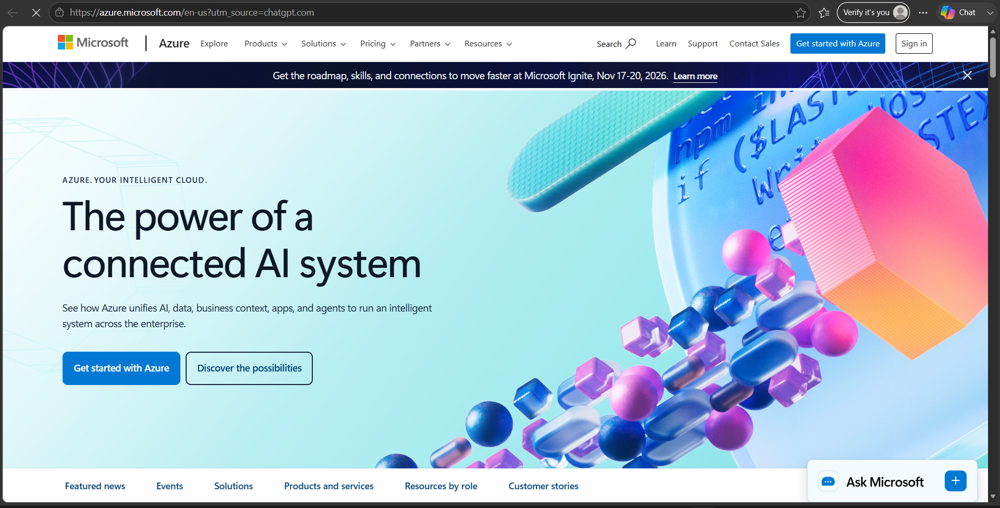

# Microsoft Azure Research

## Brief Overview

Microsoft Azure is a cloud computing platform developed by Microsoft. It provides a wide range of cloud services that organizations can use to build, deploy, manage, and scale applications and IT infrastructure. Azure supports services for computing, storage, databases, networking, artificial intelligence, security, and analytics.

## Global Infrastructure

Microsoft Azure operates through a global infrastructure made up of **geographic regions, availability zones, and data centers**. Azure regions are located in different parts of the world, allowing organizations to deploy applications closer to their users. Availability Zones provide physically separate locations within supported regions to improve application availability and resilience.

Azure's global infrastructure helps organizations reduce latency, improve reliability, and support disaster recovery.

## Cloud Management Console

The main management interface for Microsoft Azure is the **Azure Portal**. It is a web-based management console that allows users to create, configure, monitor, and manage Azure resources.

Official Azure Portal: https://portal.azure.com/

Users can manage virtual machines, storage accounts, databases, networks, security settings, and other cloud resources through the portal.

## Four (4) Core Services

| Azure Service | Description |
|---|---|
| **Azure Virtual Machines** | Provides scalable virtual servers for running applications and operating systems in the cloud. |
| **Azure Blob Storage** | Provides cloud object storage for files, images, videos, backups, and other unstructured data. |
| **Azure Virtual Network** | Allows organizations to create private networks and securely connect Azure resources. |
| **Microsoft Entra ID** | Provides identity and access management for users, applications, and cloud resources. |

## Three (3) Advantages

1. **Scalability** – Azure allows organizations to increase or decrease computing and storage resources based on their requirements.

2. **Global Availability** – Azure has a worldwide infrastructure that allows applications and services to be deployed in different geographic regions.

3. **Security and Integration** – Azure provides security, identity, monitoring, and management features and integrates well with Microsoft's ecosystem.

## Typical Enterprise Use Cases

Microsoft Azure is commonly used by enterprises for:

- Hosting websites and business applications
- Virtual machine and server infrastructure
- Data backup and disaster recovery
- Database hosting and management
- Artificial intelligence and machine learning
- Enterprise networking
- Identity and access management
- Data analytics and business intelligence

## Screenshot

### Microsoft Azure Official Homepage

**Screenshot Source:** https://azure.microsoft.com/

### Azure Management Console

**Screenshot Source:** https://portal.azure.com/
