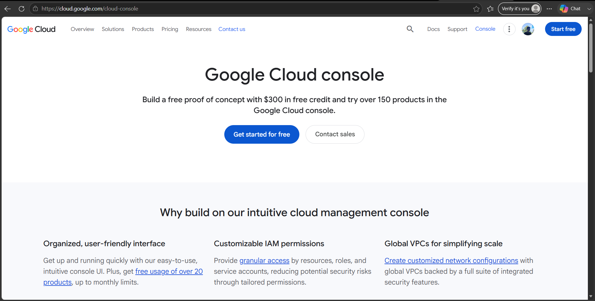

# Google Cloud Platform (GCP) Research

## Brief Overview

Google Cloud Platform (GCP), now commonly called Google Cloud, is a cloud computing platform developed by Google. It provides cloud services that organizations can use to build, deploy, manage, and scale applications and IT infrastructure. Google Cloud provides services for computing, storage, networking, databases, artificial intelligence, machine learning, and data analytics. :contentReference[oaicite:0]{index=0}

## Global Infrastructure

Google Cloud operates a global infrastructure consisting of data centers, regions, and zones. Regions are geographic locations where Google Cloud resources can be deployed, while zones are isolated locations within regions that help improve application availability and reliability.

Google Cloud's infrastructure provides connectivity across more than 200 countries and territories, with multiple regions and zones available around the world. This global infrastructure helps organizations deploy applications closer to their users, reduce latency, and improve reliability. :contentReference[oaicite:1]{index=1}

## Cloud Management Console

The main cloud management interface for Google Cloud is the **Google Cloud Console**. It is a web-based management interface that allows users to create, configure, monitor, and manage Google Cloud resources and projects.

Google Cloud Console: https://console.cloud.google.com/

The console can be used to manage virtual machines, storage, networking, databases, security settings, projects, billing, and other Google Cloud services. :contentReference[oaicite:2]{index=2}

## Four (4) Core Services

| Google Cloud Service | Description |
|---|---|
| **Compute Engine** | Provides virtual machines that organizations can use to run applications and workloads in Google's infrastructure. |
| **Cloud Storage** | Provides scalable object storage for files, images, videos, backups, and other types of data. |
| **Virtual Private Cloud (VPC)** | Provides networking capabilities for securely connecting and managing cloud resources. |
| **BigQuery** | Provides a fully managed data warehouse for analyzing large datasets and generating business insights. |

These are among the major Google Cloud services used for computing, storage, networking, and data analytics. :contentReference[oaicite:3]{index=3}

## Three (3) Advantages

1. **Scalability** – Google Cloud allows organizations to scale computing, storage, and other resources according to their workload requirements.

2. **Global Infrastructure** – Google Cloud provides a worldwide infrastructure that allows organizations to deploy applications in different regions and zones, helping improve performance and availability. :contentReference[oaicite:4]{index=4}

3. **Data and AI Capabilities** – Google Cloud provides powerful data analytics, machine learning, and artificial intelligence services that organizations can use to analyze data and develop intelligent applications. :contentReference[oaicite:5]{index=5}

## Typical Enterprise Use Cases

Google Cloud is commonly used by enterprises for:

- Hosting websites and business applications
- Virtual machine and cloud infrastructure
- Data storage and backup
- Big data analytics
- Artificial intelligence and machine learning
- Database management
- Application development and deployment
- Enterprise networking
- Disaster recovery
- Containerized applications

## Screenshot

### Google Cloud Official Homepage

**Screenshot Source:** https://cloud.google.com/

### Google Cloud Management Console

**Screenshot Source:** https://console.cloud.google.com/
